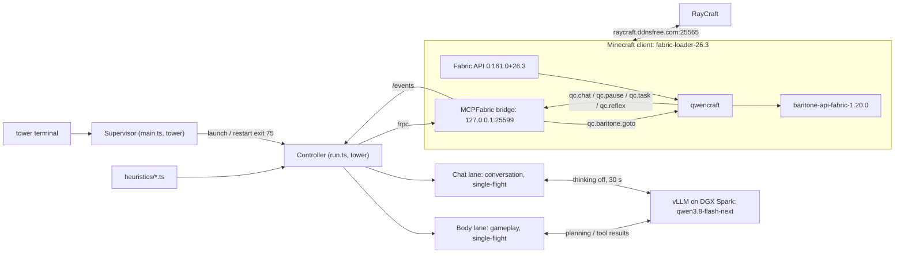

# Phase-1 harness architecture

## 1. Objective and scope

Phase 1 gives the local Qwen model a guarded body in the user's visible Minecraft client: the tower terminal supplies instructions, the controller executes verified skills in a body lane, and a parallel chat lane answers incoming non-self player mentions, whispers and eligible five-minute conversation follow-ups. System lines and replayed history are context only. The operator watches. [D-00, D-01, D-02, D-03, D-05, D-48, D-54, D-55, D-56, D-57]

| In scope | Boundary / non-goal | Decisions |
|---|---|---|
| Visible `SirWaffleshnoz` client, Fabric companion mod, Baritone navigation | No second account, headless replacement client, or server-side control deployment | [D-01] [D-08] |
| Console tasks, addressed chat Q&A and five-minute follow-ups, AI explanation when asked, idle survival progression | Other players can ask questions, not issue action instructions; the separate chat lane has no gameplay tools, and the body lane has no chat tools | [D-05, D-16, D-17, D-19, D-31, D-47, D-48, D-54, D-55] |
| Curated skills, hot-reloaded `heuristics/*.ts`, JSON notes | No model-generated executable code or general plugin framework | [D-09] [D-25] [D-33] |
| Four stop controls, action-path guards, bounded session recovery | No guarantee of third-party server permission or anti-cheat acceptance | [D-02] [D-10] [D-11] [D-24] [D-34] |
| Phase-1 harness documentation | Blueprint/house architecture is deferred, not a hidden dependency of this harness | [D-00] |

Phase-1 completion means the RayCraft acceptance exercises in [50-install-and-verification.md](50-install-and-verification.md), including chat Q&A, console tasks, 30-minute survival, all four stop controls, and heuristic hot reload—not just successful model or bridge connectivity. [D-38]

## 2. Ground truth versus planned deployment

These captures establish a baseline, not proof that the proposed companion mod or gameplay skills already work; the Fabric stack below is the chosen deployment, while the captured client was a release-profile client. [D-01] [D-12] [client process](evidence/client-process.txt)

| Surface | Captured ground truth | Planned use / qualification |
|---|---|---|
| Client | Minecraft `26.3`, `SirWaffleshnoz`, game directory `C:\Users\jlyon\AppData\Roaming\.minecraft`, version type `release`. [client process](evidence/client-process.txt) | Install `fabric-loader-26.3` into the same `.minecraft`; keep the client visible. [D-01] [D-12] |
| RayCraft | Log records `Connecting to raycraft.ddnsfree.com, 25565`; status ping advertises `Paper 26.3`, protocol `777`, and lists `SirWaffleshnoz`. [connection log](evidence/client-latest-log-connect.txt) [status ping](evidence/raycraft-status-ping.json.txt) | Use `server.host="raycraft.ddnsfree.com"`, `server.port=25565`; ping/log evidence is not an automation-permission or mod-compatibility test. [D-02] [VERIFY] Confirm owner permission and guarded gameplay acceptance. |
| Model endpoint | `http://192.168.100.2:8000/v1/models` exposes `qwen3.8-flash-next`; captured serving args bind port `8000` and advertise that alias. [models](evidence/vllm-models.json.txt) [serving args](evidence/vllm-container-args.txt) | Controller uses `llm.baseUrl="http://192.168.100.2:8000/v1"`, `llm.model="qwen3.8-flash-next"`. [D-03] [D-21] |
| Model capabilities | Five small requests demonstrated automatic tool calling, separate `message.reasoning`, and recognition of a 32×32 red image. [probe](evidence/vllm-capability-probe.json.txt) | Use tools plus on-demand `look_screenshot`; neither the toy image nor a tool-call response proves Minecraft visual/action competence. [D-09] [D-22] [VERIFY] Check gameplay screenshots and tool selection. |
| Tower toolchain | Node `v24.12.0`, Python `3.14.0`, Git `2.50.1.windows.1`; `where java` returned the Oracle `java8path` executable path. [toolchain](evidence/tower-toolchain.txt) | Controller is TypeScript/Node; mod baseline is Java 25, not the captured Java lookup result. [D-04] [D-13] [Fabric example](https://github.com/FabricMC/fabric-example-mod/blob/44465cb0eb83932c72ece5934d32ddfc758802ed/build.gradle#L43-L55) [VERIFY] Confirm JDK 25 and build-time `JAVA_HOME`; this capture does not inventory every installed JDK. |
| Shared inference | Hermes config selects provider `spark`, has Spark-local `http://127.0.0.1:8000/v1`, and names `qwen3.8-nvfp4`. [Hermes config](evidence/hermes-endpoint-config.txt) | [INFERENCE] Treat port `8000` as shared capacity; configuration is not proof of active Hermes traffic or alias compatibility. [D-03] [VERIFY] Measure contention with Hermes active. |

## 3. Topology and transport boundaries

The controller is the sole harness client of the MCPFabric bridge and calls it directly, without an additional MCP server process; `qwencraft` extends that bridge inside the same Minecraft client and delegates navigation to Baritone. [D-01] [D-03] [D-07] [D-08] The public router/event accessors support this extension point, and Baritone's primary instance addresses the game-created local player. [MCPFabric accessors](https://github.com/Etoryx/mcpfabric/blob/990490791a0a38273ce28c0b15f2e90448347e2d/src/main/java/dev/mcpfabric/McpFabric.java#L46-L52) [Baritone provider](https://github.com/cabaletta/baritone/blob/25111daedf1d59e6a8dfb5a3e61885cdb8d953df/src/api/java/baritone/api/IBaritoneProvider.java#L40-L52)

Start `controller/main.ts` as the supervisor; it launches `controller/run.ts`, the body-owning controller, and relaunches only when that child exits with code 75 for console `restart`. The handoff file beside notes preserves instruction, goal stack and active/paused intent, not running tasks. Code/config/heuristics reload; Java changes still need a Minecraft restart. [D-53] [controller/main.ts](../controller/main.ts) [controller/run.ts](../controller/run.ts)

The diagram shows the chosen process/container boundaries and contract names; internal mod arrows denote API calls, not additional network listeners. [D-01] [D-03] [D-07] [D-08] [D-25]



| From → to | Address / transport | Envelope / authority |
|---|---|---|
| Tower terminal → controller | Local terminal I/O; no listening port. [D-05] | `<free text>` and the console commands; only instruction authority. [D-05] [D-20] |
| Controller → MCPFabric bridge | `http://127.0.0.1:25599/health`, HTTP GET; unauthenticated health endpoint. [D-07] [HTTP health handler](https://github.com/Etoryx/mcpfabric/blob/990490791a0a38273ce28c0b15f2e90448347e2d/src/main/java/dev/mcpfabric/bridge/HttpBridgeServer.java#L78-L83) | Connectivity check, not evidence of being joined to RayCraft. [D-07] [VERIFY] Check joined state separately. |
| Controller → MCPFabric bridge | `http://127.0.0.1:25599/rpc`, HTTP POST, bearer token from `config/mcpfabric.config.json`. [config](https://github.com/Etoryx/mcpfabric/blob/990490791a0a38273ce28c0b15f2e90448347e2d/src/main/java/dev/mcpfabric/config/McpConfig.java#L13-L76) [HTTP bridge](https://github.com/Etoryx/mcpfabric/blob/990490791a0a38273ce28c0b15f2e90448347e2d/src/main/java/dev/mcpfabric/bridge/HttpBridgeServer.java#L92-L134) | `{method,params}` → `{ok:true,result}` or `{ok:false,error:{code,message,data?}}`; not a JSON-RPC 2.0 envelope. [HTTP bridge](https://github.com/Etoryx/mcpfabric/blob/990490791a0a38273ce28c0b15f2e90448347e2d/src/main/java/dev/mcpfabric/bridge/HttpBridgeServer.java#L92-L134) [envelope helpers](https://github.com/Etoryx/mcpfabric/blob/990490791a0a38273ce28c0b15f2e90448347e2d/src/main/java/dev/mcpfabric/bridge/Json.java#L30-L47) |
| Bridge → controller | `http://127.0.0.1:25599/events`, authenticated SSE. [D-07] [HTTP event handler](https://github.com/Etoryx/mcpfabric/blob/990490791a0a38273ce28c0b15f2e90448347e2d/src/main/java/dev/mcpfabric/bridge/HttpBridgeServer.java#L131-L163) | Consume `qc.*`; catch up with `events.getRecent{sinceId}` in the 2,000-event ring. Startup chat at/below the captured current ID and chat processed in the five seconds after each join route as history context only, never replies. [D-07, D-14, D-57] |
| Controller → vLLM | `http://192.168.100.2:8000/v1/chat/completions`, HTTP POST, model `qwen3.8-flash-next`. [probe](evidence/vllm-capability-probe.json.txt) | Single-flight per lane: one body request and one chat request may be in flight together. Only the body lane has gameplay authority. [D-09, D-20, D-55] |
| Minecraft client → RayCraft | `raycraft.ddnsfree.com:25565`, Minecraft connection; TCP status probe used protocol `777`. [connection log](evidence/client-latest-log-connect.txt) [status ping](evidence/raycraft-status-ping.json.txt) | Client remains the account/session boundary; no direct controller-to-server action channel. [D-01] [D-02] |
| Controller → heuristics | Local `heuristics/*.ts` imports and file-change hot reload; no port. [D-25] | Trusted user-authored hooks; all resulting actions still pass hard guards. [D-10] [D-25] |

Set MCPFabric `host=127.0.0.1`, `requireAuth=true`, `enableWorldWrite=false`, `enableCommands=false`, `enablePlayerControl=true`, `enableVision=true`; use `qc.chat.send` for allowlisted slash commands rather than re-enabling administrative commands. [D-10] [D-22] [D-29] [D-36] Hard protect/chat/command guards belong on the client action path, covering raw MCPFabric calls and Baritone, not just the controller's curated tools. [D-10] [D-18] [D-26] [VERIFY] Identify and prove the exact 26.3 mixin targets and bypass coverage; see [40-chat-and-safety.md](40-chat-and-safety.md). [D-10]

## 4. Layering and action granularity

Use three timescales: Qwen chooses goals/tools, controller skills drive bounded workflows and check results, and Java reflexes react without an inference round trip. [D-09] [D-21] [D-32] Mindcraft separates prioritized, interrupting modes from longer actions; Voyager retrieves reusable skills and feeds execution observations/critique into subsequent attempts. [Mindcraft modes](https://github.com/mindcraft-bots/mindcraft/blob/f6a9556cf756e6bd88a75cc2fa0d5aed7599b101/src/agent/modes.js#L13-L24) [Voyager feedback](https://github.com/MineDojo/Voyager/blob/55e45a880755d0c8c66ca7fb5fe7962ac8974f89/voyager/voyager.py#L213-L258)

| Layer | Granularity | Responsibility / authority |
|---|---|---|
| Qwen body planner | [INFERENCE] Seconds per turn, not a gameplay latency guarantee; completion, failure, instruction, or immediate `continue`. Chat never wakes this lane. [D-19, D-20, D-51, D-55] | Registry minus `chat_say`/`chat_reply`; thinking only for a new console instruction or failed-tool replan on that instruction. [D-09, D-21, D-46, D-55] |
| Qwen chat lane | Pending player mentions/whispers and eligible follow-ups run independently of body tools, at most one chat turn at a time. System/history lines are context only. [D-54, D-55, D-56, D-57] | `chat_say`, `chat_reply`, `harness_info`, `observe` only; thinking off, 30-second request deadline, up to three tool rounds. [D-55] |
| Controller skills | Seconds–minutes per task, not model-selected per-tick keypresses. [D-07] [D-09] [INFERENCE] Duration depends on terrain/resources. | Execute one body workflow; verify inventory/block/position postconditions before `{ok,summary,observedDelta}`. [D-09] |
| Java reflexes in `qwencraft` | Nominal 20 Hz / 50 ms checks; no model/network dependency. [D-32] | Priority escape lava/fire/drowning > flee_creeper > retaliate against damaging hostile > eat at food ≤14 when edible food exists. Creeper flee triggers within 5 blocks if fusing/approaching, sprints away until ≥8 blocks/gone/5 seconds, then releases keys. [D-32, D-52] |
| User heuristics | `onObservation`, `onPlanProposed`, `onChat`; nonblocking `onTick` at approximately 5–10 Hz. [D-25] [D-32] | Hints, veto/rewrite, chat decisions, guarded preempting intents; never disabling pause/protect/chat/allowlist enforcement. [D-10] [D-25] |

Optimus-3 explicitly distinguishes high-frequency System 1 action from lower-frequency System 2 planning/reflection; this harness borrows that separation, not its trained visuomotor policy or reported performance. [Optimus-3 v2, introduction](https://arxiv.org/html/2506.10357v2#S1) [D-09] [D-32] The observed ~1-second small-model responses are already far slower than a 50 ms reflex tick, so put immediate survival behavior in Java rather than repeated LLM calls. [probe](evidence/vllm-capability-probe.json.txt) [D-32]

Allow only one movement owner at a time; [INFERENCE] a reflex preempts conflicting skill/Baritone control and reports through `qc.reflex`, rather than fighting simultaneous synthetic inputs. [D-08] [D-32] `hotkey`/`manual_input` pause transfers control to the human and disables reflexes; `console`/`lease_expired` pause cancels work but retains Java survival reflexes. [D-11] [D-32] [D-35]

When `home=null`, send the allowlisted `/home` once, wait for arrival, record that position as `home`, and print it to the terminal; console `home set` overrides it, using the operator's existing `/sethome` rather than first-spawn position. [D-29] [D-31] [D-40] Self-directed progression uses `selfGoal.radius=256` measured only in horizontal x/z distance from home, not 3D distance. [D-31] [D-37] [D-39] Enforcement is controller-only: reject `go_to`/`explore`/`go_to_player`/`follow_player` targets outside that radius, poll horizontal distance during jobs, and stop beyond radius + 16; Baritone routes are not geometrically fenced. [D-31] [D-37] [D-39] [VERIFY] Exercise route overshoot and shutdown during this polling window; this is not a mod-enforced territorial boundary. [D-11] [D-37]

## 5. Agent loop, interruption, and verified reporting

| Wake event | Loop treatment | Decisions |
|---|---|---|
| New console instruction | Increment generation, cancel active work, re-observe, replan; reject old-generation results before any dispatch/report | [D-05] [D-20] |
| `qc.chat` | Preserve context. Fresh incoming non-self player mentions or whispers enter chat-lane `mustReply`; messages from a sender replied to within five minutes enter `followUps` without needing a name. Others, system lines and history are context only. Never wakes the body or supplies gameplay authority | [D-14, D-48, D-54, D-55, D-56, D-57, D-17] |
| `qc.task` / skill completion or failure | Mod event states are only `at_goal`/`calc_failed`/`canceled`/`lost_control`; controller verifies actual state and alone declares done/failed, appends `{ok,summary,observedDelta}`, then continues or replans | [D-09] [D-20] [D-42] |
| `qc.death` / respawn | Invalidate current work, auto-respawn, re-observe location/inventory before further work | [D-20] [D-24] |
| `continue` | After a current/unpaused no-tool body reply, immediately replan if instruction or home exists; conversation proceeds independently. With home but no instruction, progress tools → food → iron → shelter/bed within the horizontal radius. Neither instruction nor home means the body is `Idle`. | [D-51, D-55, D-19, D-31, D-37, D-39, D-40] |

Single-flight applies **within each of two lanes**, including locally settling canceled requests; one body and one chat request may overlap. One owned skill controls the body, and proposed tool batches execute sequentially within their lane after validation and guards. The chat lane cannot dispatch gameplay, and the body lane cannot dispatch chat tools. [D-09, D-20, D-55] A new instruction invalidates the previous generation immediately; abort where possible, but discard late stale responses rather than relying on remote cancellation. [D-20] [INFERENCE] These cancellation mechanics adapt Mindcraft's cooperative interruption pattern without inheriting ordinary-chat action authority. [Mindcraft action manager](https://github.com/mindcraft-bots/mindcraft/blob/f6a9556cf756e6bd88a75cc2fa0d5aed7599b101/src/agent/action_manager.js#L26-L112)

Each action runs through completion inside its tool call. Interrupted, obsolete-generation and no-dispatch results mean the task stopped; reissue a needed action rather than assuming background work. A no-tool reply on `continue` receives the next-action/finish-goal nudge. There is no deliberate delay between actionable turns. Ore-only mining exposes real ore through legit branch-mining at the selected mineral Y; non-ore collection still scans loaded chunks. [D-50, D-51] [Mining levels](20-companion-mod.md#9-protection-and-baritone-settings) [Loop policy](30-controller.md#6-loop-cancellation-and-self-goals)

The chat lane receives `{mustReply,followUps,recentChat,live}`: up to 30 recent chat events as context, and live goal, instruction, current skill, image-free last result and quick `player.getState` position/health. It reuses identity/safety/chat prompt rules in its own message list, never body history. Successful replies restart each answered sender's five-minute window (case-insensitive names) and clear answered entries; newly queued entries run next immediately. Any pause blocks the lane; addressed entries retain their 120-second expiry and follow-ups expire with the window. [D-54, D-55] [Detailed lane contract](30-controller.md#6-loop-cancellation-and-self-goals)

After setting up SSE, startup reads the highest current event ID once with `events.getRecent {limit:1}`; chat at/below it is history. Each `qc.join` opens a five-second processing-time grace. Both route as `loop.wake('chat history', message)`, without reply routing or lane wakes. Non-whisper GAME text matching `^Discord \u2022 (\S+) \u00bb (.*)$` is player chat from group 1 with null UUID, unsigned, unchanged text and nickname matching against group 2. Remaining system lines have `mentionsMe=false`; advancements, joins and deaths are never reply invitations. [D-56, D-57]

This `go_to` contract example shows body planning → guarded tool → observed verification → controller-owned completion, with a parallel chat reply before arrival. It illustrates scheduling, not a newly observed live pass. Each call is checked against current generation/pause state, and the lease heartbeat runs independently. [D-09, D-11, D-20, D-25, D-42, D-55]

```mermaid
sequenceDiagram
    participant T as tower terminal
    participant C as Body lane (Node, tower)
    participant H as Chat lane (Node, tower)
    participant V as vLLM on DGX Spark
    participant B as MCPFabric bridge
    participant Q as qwencraft
    T->>C: <free text>
    C->>B: /rpc: qc.baritone.stop {}
    B->>Q: qc.baritone.stop {}
    C->>C: observe
    C->>V: qwen3.8-flash-next
    V-->>C: go_to(x,y,z,range)
    C->>C: onPlanProposed
    C->>B: /rpc: qc.baritone.goto {x,y,z,range}
    B->>Q: qc.baritone.goto {x,y,z,range}
    Q-->>B: {started:true,taskId}
    B-->>C: {ok:true,result}
    Note over C,Q: Navigation continues while conversation runs
    Q-->>B: qc.chat (fresh player mention)
    B-->>H: mustReply + recentChat + live
    H->>V: conversation request (thinking off)
    V-->>H: chat_reply(to,text)
    H->>B: /rpc: qc.chat.send
    B->>Q: guarded reply (body still navigating)
    Q-->>B: qc.task {taskId,kind,state:"at_goal"}
    B-->>C: /events: qc.task
    C->>C: observe
    C->>C: verify position; declare task done
    C->>V: {ok,summary,observedDelta}
    V-->>C: summary
    C-->>T: summary
```

A `started` result or `qc.task` event is not the skill postcondition: verify position for `go_to`, inventory delta for acquisition/crafting, and observed block state for block actions. [D-09] [D-42] The mod emits only `qc.task.state="at_goal"|"calc_failed"|"canceled"|"lost_control"`; it never emits `done` or `failed`, which are controller-owned outcomes declared after the postcondition check. [D-42] Baritone goal arrival and calculation failure both deactivate the goal process; remote MCPFabric block/attack results can lack authoritative server-side confirmation. [Baritone goal process](https://github.com/cabaletta/baritone/blob/25111daedf1d59e6a8dfb5a3e61885cdb8d953df/src/main/java/baritone/process/CustomGoalProcess.java#L98-L134) [MCPFabric interaction handlers](https://github.com/Etoryx/mcpfabric/blob/990490791a0a38273ce28c0b15f2e90448347e2d/src/client/java/dev/mcpfabric/client/handlers/InteractHandlers.java#L61-L290) [VERIFY] Demonstrate client-observed changes remain stable after RayCraft synchronization. [D-38]

Construct observations from client-side perception/player state, with `qc.world.state` for dimension/time/weather and `perception.entities` for nearby entities/players. [D-01] [D-07] [client perception](https://github.com/Etoryx/mcpfabric/blob/990490791a0a38273ce28c0b15f2e90448347e2d/src/client/java/dev/mcpfabric/client/handlers/PerceptionHandlers.java#L84-L145) Do not substitute `world.getTimeAndWeather`, `entities.query`, or `players.get`: those handlers use server-side state. [server weather](https://github.com/Etoryx/mcpfabric/blob/990490791a0a38273ce28c0b15f2e90448347e2d/src/main/java/dev/mcpfabric/handlers/WorldHandlers.java#L165-L177) [server entities](https://github.com/Etoryx/mcpfabric/blob/990490791a0a38273ce28c0b15f2e90448347e2d/src/main/java/dev/mcpfabric/handlers/EntityHandlers.java#L41-L48) [server players](https://github.com/Etoryx/mcpfabric/blob/990490791a0a38273ce28c0b15f2e90448347e2d/src/main/java/dev/mcpfabric/handlers/PlayerAdminHandlers.java#L19-L35) [VERIFY] Confirm the 26.3 client-level accessors used to implement `qc.world.state`. [D-07] The observation schema, tool implementations, memory, and console grammar belong in [30-controller.md](30-controller.md). [D-07] [D-09] [D-33]

## 6. Latency and throughput budget

The probe comprised exactly five sequential small requests, totaling 137 completion tokens; it is not a sustained throughput, realistic-context, concurrent-load, or gameplay benchmark. [probe](evidence/vllm-capability-probe.json.txt)

| Stage | Observed baseline / chosen budget | Consequence |
|---|---|---|
| Tool-call reply | 0.823 s, 271 prompt tokens, 14 completion tokens. [probe](evidence/vllm-capability-probe.json.txt) | Subsecond tiny-call feasibility only. [probe](evidence/vllm-capability-probe.json.txt) Full skill latency includes execution/verification. [D-09] |
| Short nonthinking text | 1.0772 s / 30 tokens and 1.5539 s / 43 tokens; ~27.7–27.9 completion tokens per wall second. [probe](evidence/vllm-capability-probe.json.txt) | Keep routine turns concise; no per-tick planner. [D-21] [D-32] |
| Streaming | TTFT 0.2329 s; approximate decode 31.8 tok/s in one short sample. [probe](evidence/vllm-capability-probe.json.txt) | [INFERENCE] 100–200 generated tokens alone would take roughly 3–7 s at that sample decode rate, before queue/prefill costs. [D-21] |
| Thinking | 1.3955 s / 48 tokens, including 42 reasoning tokens, for a small arithmetic prompt. [probe](evidence/vllm-capability-probe.json.txt) | Thinking only for new-instruction decomposition/post-failure replanning, not routine reflexes. [D-21] [D-32] |
| LLM deadline | [INFERENCE] 30 s ordinary request; 90 s thinking-enabled planning; retry at 5/15/60 s then every 60 s. [D-20] [D-21] | Existing guarded skill may finish; no new skill/self-goal starts while inference is unavailable. [D-19] [D-20] [INFERENCE] |
| Bridge dispatch | `callTimeoutMs=8000`. [config](https://github.com/Etoryx/mcpfabric/blob/990490791a0a38273ce28c0b15f2e90448347e2d/src/main/java/dev/mcpfabric/config/McpConfig.java#L13-L76) | RPC acknowledgement timeout is not an eight-second navigation/mining task limit. [D-08] [D-09] |
| Acquisition/job progress | Ore `mine`/`collect` (any target id ending `_ore`): `min(15 min,max(5 min,count×40 s))`; any job fails after 45 seconds without ≥1-block movement or target-count change. [D-51] | Keep five-consecutive-path-failure early exit; no-break membership is O(1) with identical guard contents. [D-26, D-51] |
| Lease / reflexes | `lease.intervalMs=1000`, `lease.ttlMs=3000`; Java core nominally 20 Hz. [D-11] [D-32] | [INFERENCE] Controller-loss detection targets lease expiry plus a responsive client tick, not a hard real-time guarantee. [D-11] |
| Shared vLLM capacity | `--max-num-seqs 8`; Hermes config also references port 8000. [serving args](evidence/vllm-container-args.txt) [Hermes config](evidence/hermes-endpoint-config.txt) | Up to two harness requests (one per lane) do not reserve capacity or guarantee reply latency under shared load. [D-03, D-20, D-55] [INFERENCE] |
| Chat output | ≥3000 ms between sends, ≤256 characters, ≤2 reply lines. [D-18] | Queue/rate limit in policy and enforce sends in mod; response generation does not bypass send cadence. [D-18] |

[VERIFY] During the build, measure full-context TTFT/turn duration and observation/bridge round trips on the tower with Hermes active, including screenshot turns and planning mode; retain separate model, queue, skill-execution, and verification timings rather than promoting the tiny probe into an SLA. [D-21] [D-22] [D-38]

## 7. Threading and ownership

MCPFabric HTTP workers schedule client handlers on the Minecraft executor and wait for results; a timeout cancels queued work that has not started, but already-started work may still finish. [HTTP workers](https://github.com/Etoryx/mcpfabric/blob/990490791a0a38273ce28c0b15f2e90448347e2d/src/main/java/dev/mcpfabric/bridge/HttpBridgeServer.java#L49-L63) [client adapter](https://github.com/Etoryx/mcpfabric/blob/990490791a0a38273ce28c0b15f2e90448347e2d/src/client/java/dev/mcpfabric/client/ClientMc.java#L69-L72) [main-thread dispatch](https://github.com/Etoryx/mcpfabric/blob/990490791a0a38273ce28c0b15f2e90448347e2d/src/main/java/dev/mcpfabric/bridge/MainThread.java#L24-L64) Therefore observe state before retrying a timed-out mutation; do not confuse transport failure with action failure. [D-09]

| Execution domain | Work placed here | Constraint |
|---|---|---|
| Tower Node controller | Console/SSE processing, model request, skills, lease timer, user heuristics. [D-03] [D-04] [D-07] [D-25] | Asynchronous waits must leave heartbeat/stop processing runnable; `onTick` must be nonblocking. [D-11] [D-25] [D-32] |
| Minecraft client main thread | Register/control `qc.*` behavior, read world/player state, pause checks, reflexes, HUD, action-path guards. [D-08] [D-11] [D-23] [D-32] | No model calls, blocking network waits, or long computations here. [D-03] [D-32] [INFERENCE] |
| Baritone | Tick-driven goal process with distinct failure/control-loss paths. [goal process](https://github.com/cabaletta/baritone/blob/25111daedf1d59e6a8dfb5a3e61885cdb8d953df/src/main/java/baritone/process/CustomGoalProcess.java#L98-L134) | Companion owns task correlation and emits only progress/failure/control-loss events; controller alone declares done/failed after postcondition verification, never from inactivity alone. [D-08] [D-09] [D-42] |
| Spark vLLM | Model inference, separate from game-thread execution. [D-03] [serving args](evidence/vllm-container-args.txt) | Slow/down inference must not block physical takeover or local reflexes. [D-11] [D-32] |

The client-only HUD has four lines: green `Qwen active` or red `PAUSED (<reason>)`, then `Goal: <goal>`, `Action: <action>`, and `Status: <status>`, truncated to screen width. `qc.hud.set` accepts `{goal?:string,action?:string,status?:string}` → `{ok:true}`; omitted fields are unchanged and empty strings clear them. The mod tracks status-text changes and appends ` (<N>s)` after at least 2 unchanged seconds, with N the whole elapsed seconds. The controller reports tool/compact arguments (arguments capped at 60 characters) then done/failed summaries (action capped at 120 characters), not model prose, and sets exact phase statuses: `Waiting for Qwen`, `Qwen is thinking`, `Summarizing memory`, `Running <tool>`, `Idle`, or `Qwen unreachable, retrying in <N>s` (N is seconds until `retryAt`). [HUD contract](20-companion-mod.md#10-hud-and-session-lifecycle) [controller/loop.ts](../controller/loop.ts)

Pause releases all synthetic controls: movement, mining, navigation, item use, attack/use, and Baritone work—not just movement booleans—and emits `qc.pause`. [D-11] [D-35] Baritone documents that cancellation can leave an uncancelable movement finishing, so the hard-stop claim must be demonstrated with the actual mixins and client version. [Baritone cancellation](https://github.com/cabaletta/baritone/blob/25111daedf1d59e6a8dfb5a3e61885cdb8d953df/src/api/java/baritone/api/behavior/IPathingBehavior.java#L74-L105) [VERIFY] Distinguish physical from synthetic input and prove all four stop controls release the complete input set. [D-11] [D-38]

Chat appears only when Jared types in-game (or uses console `say <text>`) or the agent replies to a fresh non-self player mention, whisper or eligible five-minute follow-up. Activation, F8/manual takeover, stop/quit, lease expiry and disconnect produce no lifecycle chat. Model chat tools require a chat-lane request with at least one `mustReply`/`followUps` entry; other attempts retain `chat is only for replying to a message that mentions you`. The body lane has no chat tools. System lines, non-addressed context outside a conversation window, and history never authorize replies. AI explanation when asked and allowlisted commands such as `/home` remain permitted. [D-48, D-47, D-54, D-55, D-56, D-57, D-16, D-29]

## 8. Failure domains and recovery

| Failure domain | Immediate behavior | Recovery / limitation |
|---|---|---|
| Controller crash / unresponsive Node loop | After lease expiry, mod pauses with `lease_expired`, cancels work and releases synthetic input; Java reflexes remain active. [D-11] [D-32] | Restart controller, inspect `qc.control.state` and current observation before `resume`; no stale task/response replay. [D-11] [D-20] [INFERENCE] Dead-man proof runs in a safe, full-food, hazard-free spot. [D-38] |
| Console `restart` | Save `controller-restart.json` beside notes, run quit cleanup and exit 75; supervisor relaunches the controller. [D-53] | Consume/delete a valid ≤10-minute instruction/goal-stack snapshot; active intent uses normal auto-resume, paused intent stays paused. Stale/malformed state is ignored/reported. Java mod changes still require Minecraft restart. [D-53, D-20] |
| LLM endpoint error / timeout | Running deterministic guarded skill may finish, but no new skill starts; keep lease, console, guards/reflexes alive, preserve the last tool action and set `qc.hud.set` status to `Qwen unreachable, retrying in <N>s` (N is seconds until `retryAt`). Compaction failures also log their error message. [controller/loop.ts](../controller/loop.ts) [D-11] [D-20] [D-23] [D-32] | 30 s / 90 s deadlines and 5/15/60 s retry sequence; suspend idle self-goals and re-observe before resumed planning. Empty tools are omitted from compaction requests to avoid vLLM HTTP 400; HTTP errors include the response body as `LLM HTTP <code>: <text>`. [controller/llm.ts](../controller/llm.ts) [D-19] [D-20] [D-21] |
| Client disconnect from RayCraft | `qc.disconnect` invalidates in-world work; no world interaction while disconnected. [D-20] [D-24] | `qc.session.connect` after 30/120/600 s backoff, at most three reconnects; reset the reconnect counter only after one hour of stable connection without a disconnect, not a rolling window. [D-24] [D-34] [D-41] A fourth disconnect before reset stops the agent until console `resume`; stop immediately on `ban`, `banned`, or `kicked by` text; `qc.join` precedes re-observation. [D-24] [D-34] [D-41] |
| Player death | `qc.death` invalidates work; controller requests `qc.session.respawn`. [D-20] [D-24] | Re-observe actual inventory/location; no assumption of inventory retention or prior skill completion. [D-09] [D-24] [INFERENCE] |
| Baritone calculation failure / cancellation / control loss | Mod reports `qc.task` with `calc_failed`/`canceled`/`lost_control`, not a final `failed`; `at_goal` is likewise not final `done`. [D-42] | Controller re-observes position/inventory and verifies the skill postcondition before declaring done/failed and deciding whether to replan; Baritone inactivity is never sufficient proof. [D-09] [D-20] [D-42] |
| Spark down / tower–Spark link down | Same inference-outage policy while tower/client remain alive; lease does not expire merely because Spark is unavailable. [D-03] [D-11] [D-32] [INFERENCE] | Restore endpoint and re-observe before new planning; Java reflexes cannot provide full autonomous progression without a planner. [D-19] [D-32] [INFERENCE] |
| Client process crash / stalled main thread | Bridge/local mod/reflex/lease processing is unavailable or stalled; lease cannot make a dead client execute a pause. [D-01] [D-11] [D-32] [INFERENCE] | Relaunch Fabric client, rejoin under recovery limits, verify controls/guards before `resume`. [D-12] [D-24] [D-34] [INFERENCE] |
| SSE interruption / missed events | Catch up using `events.getRecent{sinceId}`; retained history is bounded to 2,000 events. [D-07] [catch-up handler](https://github.com/Etoryx/mcpfabric/blob/990490791a0a38273ce28c0b15f2e90448347e2d/src/main/java/dev/mcpfabric/handlers/ChatHandlers.java#L31-L38) [event ring](https://github.com/Etoryx/mcpfabric/blob/990490791a0a38273ce28c0b15f2e90448347e2d/src/main/java/dev/mcpfabric/events/EventBus.java#L18-L68) | [INFERENCE] If a gap exceeds retention, re-observe rather than invent lost task/chat outcomes. [D-09] [D-15] |

The dead-man protects loss of the controller, not loss of the model while a healthy controller keeps renewing its lease; `hotkey`/`manual_input` are the complete human-takeover path, whereas `console`/`lease_expired` intentionally leave survival reflexes active. [D-11] [D-32] [D-35] [VERIFY] Record the D-38 release tests and outage behavior rather than inferring them from configuration. [D-38]

## 9. Detailed contracts and build proof

| Read next | Contract ownership | Decisions |
|---|---|---|
| [00-decisions.md](00-decisions.md) | Operator adjudications and accepted tensions | [D-00]–[D-48] |
| [20-companion-mod.md](20-companion-mod.md) | Java/Fabric baseline, RPC/event tables, tick ownership, guards, HUD, client session hooks | [D-08] [D-11] [D-13] [D-14] [D-23] [D-32] |
| [30-controller.md](30-controller.md) | Tools/postconditions, observations, generation loop, heuristics, notes, console, outage policy | [D-04] [D-05] [D-07] [D-09] [D-20] [D-25] [D-33] |
| [40-chat-and-safety.md](40-chat-and-safety.md) | Trust boundaries, disclosure, chat/command limits, build protection, stop precedence, account risk | [D-10] [D-11] [D-15] [D-16] [D-17] [D-18] [D-26] |
| [50-install-and-verification.md](50-install-and-verification.md) | Installation, staged bring-up, acceptance evidence, rollback | [D-12] [D-38] |
| [references.md](references.md) | Pinned upstream sources and captured local evidence | [D-00] [D-38] |
